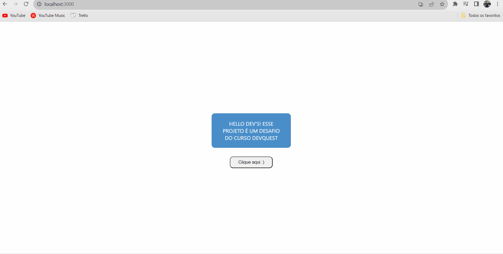

# GitHub API - buscando usuários com fetch
Esse projeto é uma Quest do curso DevQuest e será enviada para correção. O objetivo é aplicar os conceitos aprendidos no módulo de React básico:

## Índice

- Design
- Links
- Tecnologias utilizadas

## Visão geral

### Design desktop 🖥️

## Links

- Link do projeto: [Visualizar projeto](http://localhost:3000/)

## Tecnologias utilizadas

- HTML
- CSS
- JS
- React
